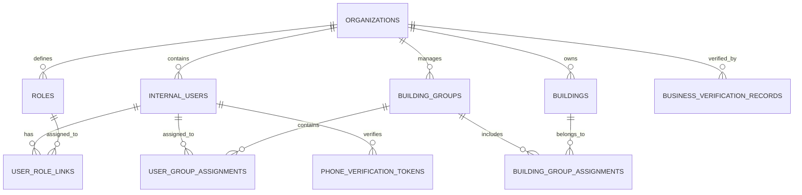

# 설계 문서

## 개요

QIRO 건물 관리 SaaS 플랫폼의 사업자 회원가입 및 멀티테넌시 구조를 위한 데이터베이스 설계입니다. 이 설계는 사업자 인증, 조직 관리, 건물 그룹 관리, 담당자 배치, 권한 관리를 포함한 완전한 멀티테넌트 아키텍처를 제공합니다.

## 아키텍처

### 멀티테넌시 아키텍처 패턴

본 설계는 **Shared Database, Shared Schema** 패턴을 채택하여 다음과 같은 특징을 가집니다:

- 모든 테넌트가 동일한 데이터베이스와 스키마를 공유
- 각 테이블에 `organization_id` 필드를 통한 데이터 격리
- Row Level Security (RLS)를 통한 자동 데이터 필터링
- 비용 효율적이면서도 확장 가능한 구조

### 보안 모델

- **조직 수준 격리**: 모든 데이터는 조직별로 완전히 분리
- **역할 기반 접근 제어 (RBAC)**: 세분화된 권한 관리
- **건물 그룹 기반 접근 제어**: 담당자별 접근 범위 제한
- **감사 로그**: 모든 중요한 작업에 대한 추적 가능성

## 컴포넌트 및 인터페이스

### 1. 조직 관리 컴포넌트

#### Companies 테이블
```sql
CREATE TABLE companies (
    company_id UUID PRIMARY KEY DEFAULT gen_random_uuid(),
    business_registration_number VARCHAR(20) UNIQUE NOT NULL,
    company_name VARCHAR(255) NOT NULL,
    representative_name VARCHAR(100) NOT NULL,
    business_address TEXT NOT NULL,
    contact_phone VARCHAR(20) NOT NULL,
    contact_email VARCHAR(255) NOT NULL,
    business_type VARCHAR(50) NOT NULL,
    establishment_date DATE NOT NULL,
    verification_status VARCHAR(20) NOT NULL DEFAULT 'PENDING' 
        CHECK (verification_status IN ('PENDING', 'VERIFIED', 'REJECTED', 'SUSPENDED')),
    verification_date TIMESTAMPTZ,
    subscription_plan VARCHAR(50) DEFAULT 'BASIC',
    subscription_status VARCHAR(20) DEFAULT 'ACTIVE' 
        CHECK (subscription_status IN ('ACTIVE', 'SUSPENDED', 'CANCELLED')),
    created_at TIMESTAMPTZ NOT NULL DEFAULT now(),
    updated_at TIMESTAMPTZ NOT NULL DEFAULT now(),
    created_by UUID,
    updated_by UUID
);
```

### 2. 사용자 관리 컴포넌트

#### Users 테이블
```sql
CREATE TABLE users (
    user_id UUID PRIMARY KEY DEFAULT gen_random_uuid(),
    company_id UUID NOT NULL REFERENCES companies(company_id) ON DELETE CASCADE,
    email VARCHAR(255) NOT NULL,
    password_hash VARCHAR(255) NOT NULL,
    full_name VARCHAR(100) NOT NULL,
    phone_number VARCHAR(20),
    department VARCHAR(100),
    position VARCHAR(100),
    user_type VARCHAR(20) NOT NULL DEFAULT 'EMPLOYEE' 
        CHECK (user_type IN ('SUPER_ADMIN', 'EMPLOYEE')),
    status VARCHAR(20) NOT NULL DEFAULT 'ACTIVE' 
        CHECK (status IN ('ACTIVE', 'INACTIVE', 'LOCKED', 'PENDING_VERIFICATION')),
    email_verified BOOLEAN NOT NULL DEFAULT false,
    phone_verified BOOLEAN NOT NULL DEFAULT false,
    last_login_at TIMESTAMPTZ,
    failed_login_attempts INTEGER DEFAULT 0,
    locked_until TIMESTAMPTZ,
    created_at TIMESTAMPTZ NOT NULL DEFAULT now(),
    updated_at TIMESTAMPTZ NOT NULL DEFAULT now(),
    created_by UUID,
    updated_by UUID,
    
    UNIQUE(organization_id, email)
);
```

### 3. 역할 및 권한 관리 컴포넌트

#### Roles 테이블
```sql
CREATE TABLE roles (
    role_id UUID PRIMARY KEY DEFAULT gen_random_uuid(),
    company_id UUID REFERENCES companies(company_id) ON DELETE CASCADE,
    role_name VARCHAR(100) NOT NULL,
    role_code VARCHAR(50) NOT NULL,
    description TEXT,
    is_system_role BOOLEAN NOT NULL DEFAULT false,
    permissions JSONB NOT NULL DEFAULT '{}',
    created_at TIMESTAMPTZ NOT NULL DEFAULT now(),
    updated_at TIMESTAMPTZ NOT NULL DEFAULT now(),
    
    UNIQUE(company_id, role_code)
);
```

#### User Role Links 테이블
```sql
CREATE TABLE user_role_links (
    user_id UUID NOT NULL REFERENCES users(user_id) ON DELETE CASCADE,
    role_id UUID NOT NULL REFERENCES roles(role_id) ON DELETE CASCADE,
    assigned_at TIMESTAMPTZ NOT NULL DEFAULT now(),
    assigned_by UUID REFERENCES users(user_id),
    
    PRIMARY KEY (user_id, role_id)
);
```

### 4. 건물 그룹 관리 컴포넌트

#### Building Groups 테이블
```sql
CREATE TABLE building_groups (
    group_id UUID PRIMARY KEY DEFAULT gen_random_uuid(),
    organization_id UUID NOT NULL REFERENCES organizations(organization_id) ON DELETE CASCADE,
    group_name VARCHAR(255) NOT NULL,
    group_type VARCHAR(50) NOT NULL 
        CHECK (group_type IN ('COST_ALLOCATION', 'MANAGEMENT_UNIT', 'GEOGRAPHIC', 'CUSTOM')),
    description TEXT,
    is_active BOOLEAN NOT NULL DEFAULT true,
    created_at TIMESTAMPTZ NOT NULL DEFAULT now(),
    updated_at TIMESTAMPTZ NOT NULL DEFAULT now(),
    created_by UUID REFERENCES internal_users(user_id),
    updated_by UUID REFERENCES internal_users(user_id),
    
    UNIQUE(organization_id, group_name)
);
```

#### Building Group Assignments 테이블
```sql
CREATE TABLE building_group_assignments (
    assignment_id UUID PRIMARY KEY DEFAULT gen_random_uuid(),
    group_id UUID NOT NULL REFERENCES building_groups(group_id) ON DELETE CASCADE,
    building_id UUID NOT NULL REFERENCES buildings(building_id) ON DELETE CASCADE,
    assigned_at TIMESTAMPTZ NOT NULL DEFAULT now(),
    assigned_by UUID REFERENCES internal_users(user_id),
    
    UNIQUE(group_id, building_id)
);
```

### 5. 담당자 배치 관리 컴포넌트

#### User Group Assignments 테이블
```sql
CREATE TABLE user_group_assignments (
    assignment_id UUID PRIMARY KEY DEFAULT gen_random_uuid(),
    user_id UUID NOT NULL REFERENCES internal_users(user_id) ON DELETE CASCADE,
    group_id UUID NOT NULL REFERENCES building_groups(group_id) ON DELETE CASCADE,
    access_level VARCHAR(20) NOT NULL DEFAULT 'READ' 
        CHECK (access_level IN ('read', 'write', 'admin')),
    assigned_at TIMESTAMPTZ NOT NULL DEFAULT now(),
    assigned_by UUID REFERENCES internal_users(user_id),
    expires_at TIMESTAMPTZ,
    is_active BOOLEAN NOT NULL DEFAULT true,
    
    UNIQUE(user_id, group_id)
);
```

### 6. 인증 및 검증 컴포넌트

#### Business Verification Records 테이블
```sql
CREATE TABLE business_verification_records (
    verification_id UUID PRIMARY KEY DEFAULT gen_random_uuid(),
    organization_id UUID NOT NULL REFERENCES organizations(organization_id) ON DELETE CASCADE,
    verification_type VARCHAR(50) NOT NULL 
        CHECK (verification_type IN ('BUSINESS_REGISTRATION', 'PHONE_VERIFICATION', 'EMAIL_VERIFICATION')),
    verification_data JSONB NOT NULL,
    verification_status VARCHAR(20) NOT NULL 
        CHECK (verification_status IN ('PENDING', 'SUCCESS', 'FAILED', 'EXPIRED')),
    verification_date TIMESTAMPTZ,
    expiry_date TIMESTAMPTZ,
    error_message TEXT,
    created_at TIMESTAMPTZ NOT NULL DEFAULT now(),
    updated_at TIMESTAMPTZ NOT NULL DEFAULT now()
);
```

#### Phone Verification Tokens 테이블
```sql
CREATE TABLE phone_verification_tokens (
    token_id UUID PRIMARY KEY DEFAULT gen_random_uuid(),
    user_id UUID NOT NULL REFERENCES internal_users(user_id) ON DELETE CASCADE,
    phone_number VARCHAR(20) NOT NULL,
    verification_code VARCHAR(10) NOT NULL,
    token_hash VARCHAR(255) NOT NULL,
    expires_at TIMESTAMPTZ NOT NULL,
    is_used BOOLEAN NOT NULL DEFAULT false,
    used_at TIMESTAMPTZ,
    attempts INTEGER DEFAULT 0,
    created_at TIMESTAMPTZ NOT NULL DEFAULT now()
);
```

## 데이터 모델

### 핵심 엔티티 관계



### 데이터 격리 전략

#### Row Level Security (RLS) 정책

```sql
-- Organizations 테이블 RLS
ALTER TABLE organizations ENABLE ROW LEVEL SECURITY;

CREATE POLICY org_isolation_policy ON organizations
    FOR ALL
    TO application_role
    USING (organization_id = current_setting('app.current_organization_id')::UUID);

-- Internal Users 테이블 RLS
ALTER TABLE internal_users ENABLE ROW LEVEL SECURITY;

CREATE POLICY user_org_isolation_policy ON internal_users
    FOR ALL
    TO application_role
    USING (organization_id = current_setting('app.current_organization_id')::UUID);

-- Building Groups 테이블 RLS
ALTER TABLE building_groups ENABLE ROW LEVEL SECURITY;

CREATE POLICY group_org_isolation_policy ON building_groups
    FOR ALL
    TO application_role
    USING (organization_id = current_setting('app.current_organization_id')::UUID);
```

## 오류 처리

### 비즈니스 규칙 검증

#### 조직 관련 제약조건
- 사업자등록번호는 시스템 전체에서 유일해야 함
- 조직당 최소 1명의 SUPER_ADMIN 사용자가 존재해야 함
- 조직 삭제 시 모든 관련 데이터가 cascade 삭제됨

#### 사용자 관련 제약조건
- 이메일은 조직 내에서 유일해야 함
- 사용자는 최소 1개의 역할을 가져야 함
- SUPER_ADMIN 역할은 조직당 최대 5명까지 제한

#### 그룹 관리 제약조건
- 그룹명은 조직 내에서 유일해야 함
- 건물은 여러 그룹에 속할 수 있음
- 사용자는 여러 그룹을 담당할 수 있음

### 오류 처리 함수

```sql
-- 조직 생성 시 기본 역할 자동 생성
CREATE OR REPLACE FUNCTION create_default_roles_for_organization()
RETURNS TRIGGER AS $$
BEGIN
    -- SUPER_ADMIN 역할 생성
    INSERT INTO roles (organization_id, role_name, role_code, description, is_system_role, permissions)
    VALUES (
        NEW.organization_id,
        '총괄관리자',
        'SUPER_ADMIN',
        '모든 권한을 가진 최고 관리자',
        true,
        '{"*": ["*"]}'::jsonb
    );
    
    -- BUILDING_MANAGER 역할 생성
    INSERT INTO roles (organization_id, role_name, role_code, description, is_system_role, permissions)
    VALUES (
        NEW.organization_id,
        '관리소장',
        'BUILDING_MANAGER',
        '건물 관리 담당자',
        true,
        '{"buildings": ["read", "update"], "tenants": ["*"], "maintenance": ["*"]}'::jsonb
    );
    
    -- ACCOUNTANT 역할 생성
    INSERT INTO roles (organization_id, role_name, role_code, description, is_system_role, permissions)
    VALUES (
        NEW.organization_id,
        '경리담당자',
        'ACCOUNTANT',
        '회계 및 관리비 담당자',
        true,
        '{"accounting": ["*"], "invoices": ["*"], "payments": ["*"]}'::jsonb
    );
    
    RETURN NEW;
END;
$$ LANGUAGE plpgsql;

CREATE TRIGGER create_default_roles_trigger
    AFTER INSERT ON organizations
    FOR EACH ROW
    EXECUTE FUNCTION create_default_roles_for_organization();
```

## 테스팅 전략

### 단위 테스트
- 각 테이블의 제약조건 검증
- 트리거 함수 동작 확인
- RLS 정책 적용 검증

### 통합 테스트
- 사업자 가입 전체 플로우 테스트
- 멀티테넌시 데이터 격리 테스트
- 권한 기반 접근 제어 테스트

### 성능 테스트
- 대용량 데이터 환경에서의 RLS 성능
- 복잡한 권한 쿼리 성능
- 동시 접속 시나리오 테스트

## 보안 고려사항

### 데이터 암호화
- 비밀번호: bcrypt 해싱
- 민감한 개인정보: AES-256 암호화
- API 키 및 토큰: 별도 암호화 저장

### 접근 제어
- 애플리케이션 레벨에서 조직 컨텍스트 설정
- 데이터베이스 레벨에서 RLS를 통한 이중 보안
- 감사 로그를 통한 모든 접근 추적

### 인증 보안
- JWT 토큰 기반 인증
- 리프레시 토큰을 통한 세션 관리
- 다단계 인증 지원 준비

## 확장성 고려사항

### 수평 확장
- 조직별 데이터 파티셔닝 준비
- 읽기 전용 복제본을 통한 부하 분산
- 캐싱 전략 수립

### 기능 확장
- 플러그인 아키텍처를 위한 확장 포인트
- 외부 시스템 연동을 위한 API 게이트웨이
- 이벤트 기반 아키텍처 준비