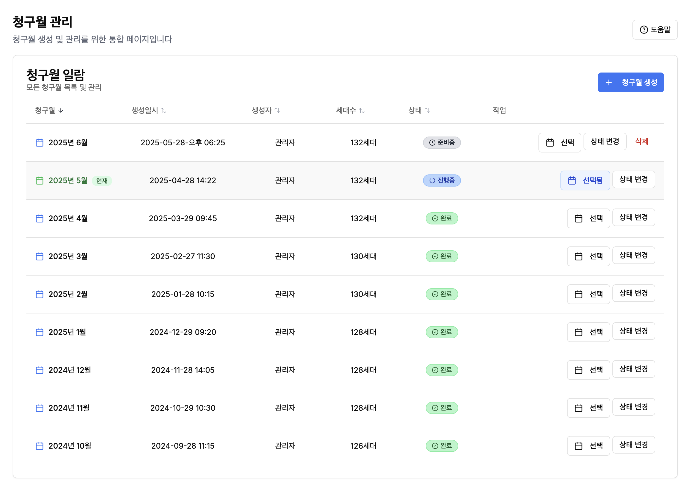
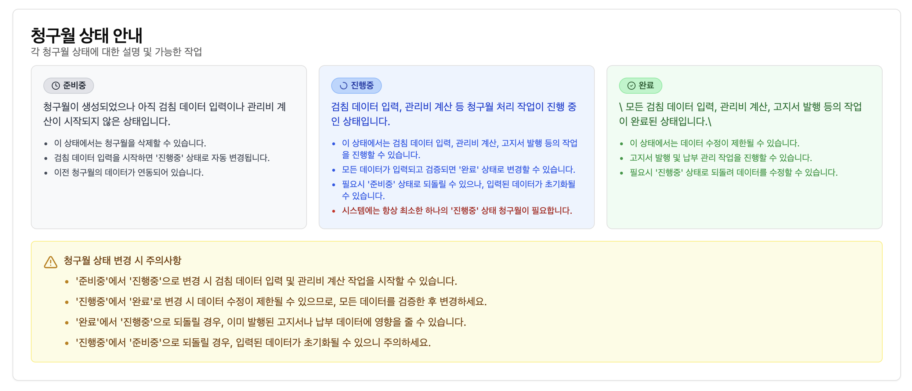

# ⚙️ QIRO - 청구월 관리 기능 명세서

## 1. 문서 정보
- **문서명:** QIRO - 청구월 관리 기능 명세서
- **기능 ID (선택 사항):** F-BILL-MGT-001
- **관련 요구사항 ID:** (예: QIRO-FR-BMGT-001)
- **관련 사용자 스토리 ID:** (예: US-BM-XXX, US-AS-XXX)
- **작성일:** 2025년 05월 28일
- **최종 수정일:** 2025년 05월 28일
- **작성자:** QIRO 기획팀
- **검토자/승인자 (선택 사항):** (이름 또는 팀)
- **문서 버전:** 1.0

## 2. 기능 개요
### 2.1. 목적
관리비를 부과할 대상 연월(이하 '청구월')을 생성하고, 각 청구월의 작업 진행 상태(예: 입력 중, 산정 완료, 고지 완료, 마감)를 체계적으로 관리한다. 이 기능을 통해 특정 청구월을 기준으로 관리비 관련 모든 작업(공과금 입력, 관리비 등록, 관리비 산정, 고지서 발급, 수납 처리 등)의 컨텍스트를 제공하고, 데이터의 정합성을 유지한다.

### 2.2. 설명
본 기능은 관리자가 관리비 작업을 수행할 특정 '청구월'(예: 2025년 6월)을 시스템에 생성하고, 해당 청구월에 대한 관리비 작업이 어느 단계까지 진행되었는지를 상태 값으로 관리할 수 있게 한다. 사용자는 목록에서 특정 청구월을 선택하여 관련 상세 작업을 진행할 수 있다.

### 2.3. 범위
- **In-Scope (포함 범위):**
    - 신규 청구월 생성 (대상 연도, 월 지정)
    - 청구월 목록 조회 (연도별 필터링 기능)
    - 청구월 상태 변경 (예: '입력 중' -> '산정 완료' -> '고지 완료' -> '마감')
- **Out-of-Scope (제외 범위):**
    - 청구월별 상세 데이터 입력/산정/고지/수납 자체의 기능 (각각 별도 기능 명세서에서 정의)
    - 마감된 청구월의 데이터 수정 (원칙적으로 불가, 정정 절차는 별도)

## 3. 사용자 인터페이스 (UI) 및 상호작용
### 3.1. 관련 화면
- `관리비 관리 > 청구월 관리`

### 3.2. UI 요소별 상세 설명
- **화면 1: 청구월 목록 조회 및 관리 화면**
    
    
    
    
    
    | UI 요소 ID (선택) | 요소명 (Label)                       | 유형 (Type)  | 기본값/표시 데이터 | 동작 설명                                                    | 유효성 규칙/제약조건 | 비고                                |
    | :---------------- | :----------------------------------- | :----------- | :----------------- | :----------------------------------------------------------- | :------------------- | :---------------------------------- |
    | BM-LST-01         | [조회 연도] 선택                     | 드롭다운     | 현재 연도          | 목록을 조회할 대상 연도 선택                                 |                      |                                     |
    | BM-LST-02         | [신규 청구월 생성] 버튼              | 버튼         | -                  | 신규 청구월 생성 팝업(또는 화면) 호출                        |                      |                                     |
    | BM-LST-03         | 청구월 목록                          | 표           | -                  | 청구월(YYYY-MM), 상태, 생성일, (관련 작업 바로가기 버튼) 등을 표시 |                      | 클릭 시 상세정보 또는 작업화면 이동 |
    | BM-LST-04         | [상태 변경] 버튼 (목록 내 또는 상세) | 버튼         | -                  | 선택된 청구월의 상태를 다음 단계로 변경 (조건부 활성화)      | 상태 전이 규칙 따름  |                                     |
    | BM-LST-05         | 페이지네이션                         | 페이지네이션 | 1                  | 목록이 많을 경우 페이지 이동                                 |                      | 최대 5년분 표시                     |
    
- **화면 2: 신규 청구월 생성 팝업/화면**
    | UI 요소 ID (선택) | 요소명 (Label) | 유형 (Type)   | 기본값/표시 데이터 | 동작 설명                       | 유효성 규칙/제약조건         | 비고 |
    | :---------------- | :------------- | :------------ | :----------------- | :------------------------------ | :--------------------------- | :--- |
    | BM-NEW-01         | 대상 연도      | 드롭다운/숫자 | 현재 연도          | 청구월 대상 연도 선택/입력      | 필수, 유효한 연도(예: 2020~) |      |
    | BM-NEW-02         | 대상 월        | 드롭다운/숫자 | 현재 월 + 1        | 청구월 대상 월 선택/입력        | 필수, 1~12                   |      |
    | BM-NEW-03         | [생성] 버튼    | 버튼          | -                  | 입력된 연/월로 신규 청구월 생성 | 해당 연월 미 존재 시 활성화  |      |
    | BM-NEW-04         | [취소] 버튼    | 버튼          | -                  | 생성 취소 및 팝업/화면 닫기     |                              |      |

### 3.3. 주요 사용자 시나리오 (흐름)
- **시나리오 1: 신규 청구월 생성**
    1. 관리자가 '청구월 목록 조회 화면'에서 [신규 청구월 생성] 버튼을 클릭한다.
    2. 시스템은 '신규 청구월 생성 팝업/화면'을 표시한다.
    3. 관리자가 대상 연도와 월을 선택(또는 입력)하고 [생성] 버튼을 클릭한다.
    4. 시스템은 해당 연월의 청구월이 이미 존재하는지 확인한다.
        - 미 존재 시: "YYYY년 MM월 청구월이 생성되었습니다. 초기 상태는 '입력 중'입니다." 메시지를 표시하고, 목록에 새 청구월을 추가한다.
        - 이미 존재 시: "이미 해당 연월의 청구월이 존재합니다." 오류 메시지를 표시한다.
- **시나리오 2: 청구월 상태 변경 (예: '입력 중' -> '산정 완료')**
    1. 관리자가 '청구월 목록 조회 화면'에서 상태를 변경할 청구월(현재 상태: '입력 중')을 선택하고 [상태 변경] 버튼을 클릭하거나, 해당 청구월 관련 작업(예: 관리비 산정) 완료 후 시스템이 자동 변경을 제안할 수 있다.
    2. (조건 확인) 시스템은 다음 상태로 변경 가능한 조건(예: '산정 완료'로 변경 시 모든 필수 입력값 완료 여부)을 확인한다.
    3. 조건 충족 시: "YYYY년 MM월 청구월의 상태를 '산정 완료'로 변경하시겠습니까?" 확인 팝업을 표시한다.
    4. 관리자가 [확인]을 클릭하면, 해당 청구월의 상태가 '산정 완료'로 변경되고 목록에 반영된다.

## 4. 데이터 요구사항
### 4.1. 청구월 (BillingMonth) 엔티티 속성
| 속성명 (Attribute) | 데이터 타입 (Type) | 필수 (PK/FK) | 설명                                  | 예시/비고                                      |
| :----------------- | :----------------- | :----------- | :------------------------------------ | :--------------------------------------------- |
| `billingMonthId`   | UUID / Long        | PK           | 청구월 고유 ID (시스템 자동 생성)     |                                                |
| `year`             | Integer            | Y            | 대상 연도                             | 2025                                           |
| `month`            | Integer            | Y            | 대상 월                               | 6 (1~12 사이 값)                               |
| `status`           | Enum / String(20)  | Y            | 청구월 상태 코드                      | `INPUTTING`, `CALC_DONE`, `NOTIFIED`, `CLOSED` |
| `description`      | String(500)        | N            | 해당 청구월에 대한 설명 또는 메모     | "하계 특별 관리비 포함"                        |
| `createdBy`        | String             | Y            | 생성자 ID                             |                                                |
| `createdAt`        | DateTime           | Y            | 생성 일시                             |                                                |
| `lastModifiedBy`   | String             | Y            | 최종 수정자 ID                        |                                                |
| `lastModifiedAt`   | DateTime           | Y            | 최종 수정 일시                        |                                                |
| `closedDate`       | Date               | N            | 마감 처리 일자 (상태가 `CLOSED`일 때) | YYYY-MM-DD                                     |

### 4.2. 청구월 상태 코드 (BillingMonthStatus) 예시
- `INPUTTING`: 입력 중 (검침값, 공용 관리비 등 데이터 입력 가능 상태)
- `CALC_READY`: 산정 준비 완료 (모든 기초 데이터 입력 완료, 산정 실행 대기)
- `CALC_DONE`: 산정 완료 (관리비 계산 완료, 고지서 발급 대기)
- `NOTIFIED`: 고지 완료 (고지서 발급/발송 완료, 수납 처리 진행 가능)
- `CLOSED`: 마감 (해당 월 모든 관리비 업무 종료, 데이터 수정 원칙적 불가)

## 5. 처리 로직 및 비즈니스 규칙
- **R-BILL-MGT-001:** 청구월은 '연도(YYYY)'와 '월(MM)'의 조합으로 고유해야 한다 (사업장/건물 그룹별 고유성).
- **R-BILL-MGT-002:** 신규 청구월 생성 시, 기본 상태는 `INPUTTING`으로 설정된다.
- **R-BILL-MGT-003:** 청구월 상태 변경은 정의된 순서(흐름)에 따라서만 가능하다. (예: `INPUTTING` -> `CALC_READY` -> `CALC_DONE` -> `NOTIFIED` -> `CLOSED`) 역방향 변경은 제한적이거나 특정 권한 필요.
- **R-BILL-MGT-004:** 각 상태별로 수행 가능한 작업이 제한된다.
    - `INPUTTING`: 검침값 입력, 공용 관리비 입력 등 가능. 관리비 산정 불가.
    - `CALC_DONE`: 관리비 산정 결과 조회, 고지서 생성 가능. 검침값 등 기초 데이터 수정 불가(또는 경고 후 수정).
    - `NOTIFIED`: 수납 처리 가능. 관리비 산정/고지서 재발행 불가 (또는 정정 절차).
    - `CLOSED`: 모든 데이터는 읽기 전용. 수정/삭제 불가. (마감 취소 기능은 최상위 관리자 권한으로 제한적 제공)
- **R-BILL-MGT-005:** 특정 청구월에 대한 작업(예: 공과금 입력, 관리비 산정)은 해당 청구월이 활성화(선택)된 컨텍스트에서만 수행되어야 한다.

## 6. 오류 처리 및 예외 관리
| 오류 코드 (선택) | 발생 조건                                    | 오류 메시지 (User-facing)                                    | 시스템 처리 방안                 |
| :--------------- | :------------------------------------------- | :----------------------------------------------------------- | :------------------------------- |
| E-BILL-MGT-01    | 이미 존재하는 연월로 청구월 생성 시도        | "YYYY년 MM월 청구월은 이미 존재합니다."                      | 생성 차단, 안내 메시지 표시      |
| E-BILL-MGT-02    | 유효하지 않은 연도 또는 월 입력              | "올바른 연도와 월을 입력해주세요."                           | 생성 차단, 입력 필드에 오류 표시 |
| E-BILL-MGT-03    | 상태 변경 조건 미충족 (예: 필수 데이터 누락) | "다음 단계로 진행하기 위한 조건이 충족되지 않았습니다. [상세 사유]" | 상태 변경 차단, 상세 사유 안내   |
| E-BILL-MGT-04    | 마감된 청구월 데이터 수정 시도               | "마감된 청구월의 데이터는 수정할 수 없습니다."               | 수정 차단, 안내 메시지 표시      |

## 7. (기능별) 성능 요구사항
- P-BILL-MGT-01: 청구월 목록 조회 시 (최대 5년치, 연간 12개) 1초 이내 응답.
- P-BILL-MGT-02: 신규 청구월 생성 및 상태 변경 작업은 0.5초 이내 처리 완료.

## 8. (기능별) 보안 요구사항
- S-BILL-MGT-01: 청구월 생성, 상태 변경, 삭제(제한적) 등의 주요 작업은 '총괄관리자' 또는 '관리소장' 역할(또는 이에 준하는 권한)만 수행 가능하다.
- S-BILL-MGT-02: 청구월 관련 모든 변경 이력(생성, 상태 변경, 마감 처리 등)은 감사 로그에 기록되어야 한다.

## 9. 다른 기능/모듈과의 연관성
- **선행 컨텍스트 제공:** 본 기능에서 선택/관리되는 '청구월'은 다음 기능들의 작업 기준이 된다.
    - `공과금 입력 (개별사용료 입력)`
    - `관리비 입력 (공용 관리비 입력)`
    - `관리비 산정`
    - `고지서 발급`
    - `수납 처리`
- **관리비 항목 설정:** 특정 청구월에 적용될 관리비 항목의 기준 정보를 참조할 수 있다 (항목의 유효 기간 등).

## 10. (선택 사항) 테스트 고려 사항
- 다양한 연도/월에 대한 청구월 생성 테스트.
- 청구월 상태 전이 규칙(정상 흐름, 예외 흐름) 테스트.
- 마감된 청구월에 대한 데이터 수정 시도 시 차단 여부 테스트.
- 특정 청구월 선택 시 다른 기능(공과금 입력 등)에서 해당 청구월 컨텍스트가 올바르게 유지되는지 연계 테스트.

## 11. 용어 정의 (선택 사항)
- **청구월 (Billing Month):** 관리비를 산정하고 부과하는 기준이 되는 특정 연도와 월 (예: 2025년 6월분).
- **청구월 상태 (Billing Month Status):** 해당 청구월의 관리비 관련 작업 진행 단계를 나타내는 코드.

## 12. 문서 이력
| 버전 | 날짜       | 작성자      | 주요 변경 내용   |
| :--- | :--------- | :---------- | :--------------- |
| 1.0  | 2025-05-28 | QIRO 기획팀 | 초기 명세서 작성 |