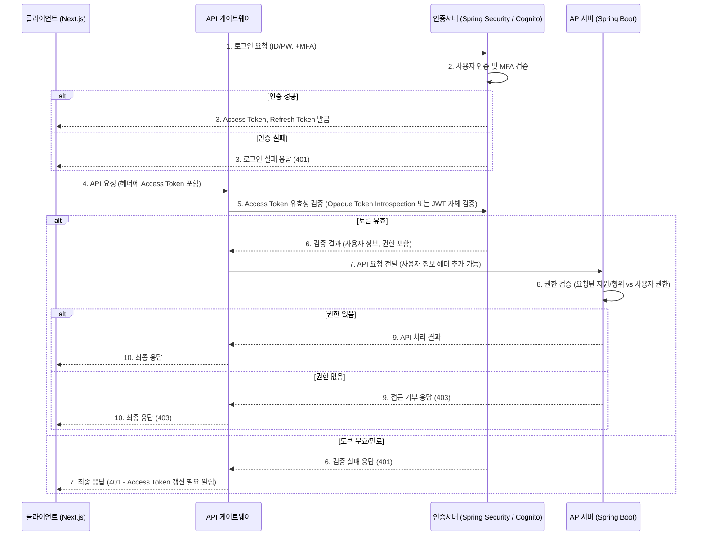

# 🔑 QIRO 인증 및 권한 관리 설계

## 1. 문서 정보
- **문서명:** QIRO 인증 및 권한 관리 설계
- **프로젝트명:** QIRO (중소형 건물관리 SaaS) 프로젝트
- **작성일:** 2025년 05월 28일
- **최종 수정일:** 2025년 05월 28일
- **작성자:** (이름 또는 보안/아키텍처팀)
- **검토자/승인자 (선택 사항):** (이름 또는 팀)
- **문서 버전:** 1.0

## 2. 개요
### 2.1. 문서 목적
본 문서는 QIRO 서비스의 사용자 인증(Authentication) 및 권한 관리(Authorization) 메커니즘을 상세히 설계하여, 비인가 접근을 차단하고 인가된 사용자에게는 역할에 맞는 최소한의 권한을 부여함으로써 서비스의 보안성과 안정성을 확보하는 것을 목적으로 한다.

### 2.2. 적용 범위
본 설계는 QIRO 웹 애플리케이션에 접근하는 모든 사용자(총괄관리자, 관리소장, 경리담당자, 시설관리자(협력업체) 등) 및 시스템 내부 API 호출에 적용된다.

### 2.3. 주요 설계 목표
- **강력한 인증:** 다중 요소 인증(MFA)을 포함한 안전한 사용자 인증 방식 제공.
- **최소 권한 원칙:** 각 사용자 역할에 필요한 최소한의 권한만 부여.
- **유연한 권한 관리:** 역할 변경 및 신규 역할 추가에 용이한 확장 가능한 권한 모델 구현.
- **중앙 집중식 관리:** 인증 및 권한 정보를 중앙에서 효율적으로 관리.
- **사용자 편의성:** 보안성을 해치지 않는 범위 내에서 사용자 친화적인 인증 절차 제공.

### 2.4. 참고 문서
- `00_보안_요구사항_및_정책.md`
- `API_설계_가이드라인.md`
- `사용자_역할별_스토리.md`
- `00_시스템_아키텍처_다이어그램.md`
- (Spring Security, JWT, OAuth 2.0 관련 표준 문서)

## 3. 사용자 역할 및 기본 권한 수준 정의
(상세 권한 매트릭스는 별도 문서 또는 본 문서 부록으로 관리 가능)

- **총괄관리자 (Super Administrator):**
    - QIRO 서비스 계약 주체(사업자 대표) 계정.
    - 시스템 전체 환경 설정, 구독 플랜 관리.
    - 관리 사업장(건물 그룹) 생성 및 관리.
    - 내부 사용자(관리소장, 경리담당자 등) 계정 생성, 권한 부여, 관리.
    - 전체 사업장 데이터에 대한 조회 및 감사 권한.
    - QIRO 서비스 관련 주요 정책 설정.
- **관리소장 (Building Manager / Site Manager):**
    - 담당(배정된) 건물(들)에 대한 총괄 운영 관리 권한.
    - 건물 기본 정보, 세대/호실 정보, 입주/임대 계약 정보 관리.
    - 관리비 부과 내역 생성 및 검토/승인 (경리담당자에게 전달).
    - 시설물 정보 관리, 유지보수 계획 수립 및 작업 지시 (시설관리자에게).
    - 민원 접수, 처리 담당자 배정, 진행 상황 관리.
    - (선택) 담당 건물 소속 경리담당자 계정 관리.
- **경리담당자 (Accounting Staff / Bookkeeper):**
    - 담당(배정된) 건물(들) 또는 사업장 전체의 회계 및 관리비 업무 수행 권한.
    - 관리비 정산, 고지서 발행, 수납 처리, 미납 관리.
    - 건물 운영 관련 수입/지출 기록 및 회계 장부 관리.
    - 월별/분기별 회계 보고서 생성.
- **시설관리자(협력업체) (Facility Manager - External Contractor):**
    - 관리소장으로부터 배정받은 시설 유지보수 작업에 대한 제한적 접근 권한.
    - 작업 지시 내용 조회 (담당 작업 건에 한함).
    - 작업 진행 상태 업데이트 및 완료 보고 (사진, 내용 첨부).
    - (선택) 작업 관련 견적 제출 또는 소요 비용 청구 기능 (제한적).
    - **다른 건물 정보, 입주자 정보, 회계 정보 등에는 접근 불가.**

## 4. 인증 (Authentication) 설계
### 4.1. 인증 기술 스택
- **백엔드:** Spring Security 프레임워크 활용.
- **토큰 방식:** JWT (JSON Web Token) 사용 (Stateless API 구현).
- **(선택) 외부 IDP 연동:** AWS Cognito User Pools 활용 고려 (특히 MFA, 소셜 로그인 등 고급 기능 필요시).

### 4.2. 사용자 유형별 인증 흐름
- **총괄관리자 (Super Administrator):**
    1. **최초 가입:**
        - QIRO 서비스 웹사이트에서 [사업자 회원가입] 선택.
        - 사업자 정보(사업자등록번호, 회사명, 대표자명 등) 입력.
        - **본인인증 진행:** (예: NICE평가정보, KG모빌리언스 등 외부 PG사 연동 휴대폰 본인인증 또는 공동인증서).
        - 이메일 주소(ID로 사용) 및 초기 비밀번호 설정.
        - 가입 완료 및 이메일 인증.
    2. **로그인:**
        - 이메일 주소 + 비밀번호 입력.
        - **MFA (OTP - 예: Google Authenticator) 필수 인증.**
        - 성공 시 JWT 발급.
- **관리소장 (Building Manager):**
    1. **계정 활성화 (최초):**
        - 총괄관리자가 생성한 초대 이메일/링크 수신 (유효기간: 48시간).
        - 링크 접속 후 본인 정보(이름, 연락처) 확인 및 비밀번호 설정, (선택) MFA 등록.
        - (기존 설계: 휴대폰 번호를 ID로 사용, 비밀번호, 부서 등 입력 후 총괄관리자 승인 방식도 유효)
    2. **로그인:**
        - 아이디(이메일 또는 휴대폰 번호 - 정책에 따라 통일) + 비밀번호 입력.
        - **MFA (OTP) 필수 또는 권장 (정책에 따라 결정).**
        - 성공 시 JWT 발급.
- **경리담당자 (Accounting Staff):**
    1. **계정 활성화 (최초):**
        - 총괄관리자 또는 관리소장이 시스템 내에서 계정 생성 후 임시 비밀번호와 함께 안내.
        - 최초 로그인 시 비밀번호 변경 필수, (선택) MFA 등록.
    2. **로그인:**
        - 아이디(이메일 또는 사번 등) + 비밀번호 입력.
        - (선택) MFA 적용.
        - 성공 시 JWT 발급.
- **시설관리자(협력업체) (Facility Manager - External Contractor):**
    1. **계정/접근 방식:**
        - **방식 A (계정 기반):** 관리소장이 협력업체 정보 및 담당자(시설관리자) 이메일 등록 -> 시스템에서 제한된 역할의 계정 생성 및 초기 비밀번호 안내.
        - **방식 B (작업별 접근 - 더 제한적):** 관리소장이 작업 지시 시, 해당 작업에만 접근 가능한 고유 보안 링크(토큰 포함, 유효기간 설정)를 시설관리자에게 SMS/이메일로 발송. 시설관리자는 해당 링크로 별도 로그인 없이 작업 내용 확인 및 결과 보고. (이 경우, 보고 시 추가 인증 수단 필요 가능성 있음 - 예: 간단한 PIN)
    2. **로그인 (방식 A의 경우):**
        - 아이디(이메일) + 비밀번호 입력.
        - (MFA는 일반적으로 적용하지 않으나, 계약 조건에 따라 고려 가능)
        - 성공 시 JWT (제한된 범위의 권한 포함) 발급.

### 4.3. 비밀번호 정책 및 관리
- **복잡도:** 최소 10자 이상, 영문 대/소문자, 숫자, 특수문자 중 3가지 이상 조합.
- **저장:** Bcrypt 또는 Scrypt 알고리즘 사용 (Spring Security 기본 지원 활용), Salt 포함.
- **변경:** 최초 로그인 시 변경 필수, 90일 주기 변경 권고. 최근 3회 이내 사용한 비밀번호 재사용 금지.
- **실패 처리:** 로그인 5회 연속 실패 시 계정 30분 잠금.
- **재설정:** "비밀번호 찾기" 기능 -> 등록된 이메일/휴대폰으로 인증 코드 발송 -> 본인 확인 후 임시 비밀번호 발급 또는 재설정 링크 제공.

### 4.4. 다중 요소 인증 (MFA)
- **지원 방식:** TOTP (시간 기반 일회용 비밀번호 - Google Authenticator, Authy 등 앱 지원).
- **필수 적용 대상:** 총괄관리자, 관리소장.
- **권장/선택 적용 대상:** 경리담당자.
- **등록 절차:** 최초 설정 시 QR 코드 또는 설정 키 제공. 백업 복구 코드 제공.
- **해제 절차:** 본인 확인 절차(예: 추가 이메일 인증, 관리자 승인) 후 해제.

### 4.5. 세션 및 토큰 관리 (JWT 기반)
- **Access Token:**
    - **유효 기간:** (예: 1시간 ~ 3시간 - 서비스 특성 고려하여 짧게 설정).
    - **Payload 포함 정보:** 사용자 ID, 역할(들), 주요 권한 식별자, 발급자(iss), 만료 시간(exp), 발급 시간(iat).
    - **탈취 대비:** HTTPS 필수. 민감 정보 직접 포함 지양.
- **Refresh Token:**
    - **유효 기간:** (예: 7일 ~ 30일 - Access Token보다 길게 설정).
    - **목적:** Access Token 만료 시 새로운 Access Token 발급에 사용.
    - **저장:** 서버 측 안전한 저장소(예: DB, Redis)에 사용자별로 매핑하여 저장 및 관리. (클라이언트에는 최소한의 식별자만 전달 또는 서버 사이드 세션과 연계)
    - **탈취/유출 시:** 해당 Refresh Token 즉시 무효화 기능 제공.
- **토큰 전달 방식:**
    - Access Token: HTTP Authorization 헤더 (`Bearer <token>`).
    - Refresh Token: (보안 고려) HttpOnly, Secure 속성의 쿠키 또는 서버에서 관리.
- **로그아웃:**
    - 클라이언트 측: Access Token, Refresh Token(관련 식별자) 삭제.
    - 서버 측: 해당 Refresh Token을 블랙리스트 처리하거나 DB에서 삭제하여 무효화.

## 5. 권한 관리 (Authorization) 설계
### 5.1. 권한 부여 모델
- **역할 기반 접근 제어 (RBAC - Role-Based Access Control):** 주된 권한 관리 모델.
    - 사용자는 하나 이상의 역할을 가질 수 있다.
    - 역할은 다수의 권한(Permission)을 포함한다.
- **(선택) 데이터 기반 권한 필터링:** 동일 역할이라도 자신이 담당하는 건물/사업장의 데이터에만 접근하도록 필터링. (예: 관리소장은 A건물 데이터만, 다른 관리소장은 B건물 데이터만)

### 5.2. 역할 정의 (Roles)
- 시스템에 사전 정의된 역할: `SUPER_ADMIN`, `BUILDING_MANAGER`, `ACCOUNTING_STAFF`, `FACILITY_CONTRACTOR`.
- (총괄관리자 기능) 커스텀 역할 생성 기능은 초기 버전에서는 제외.

### 5.3. 권한 정의 (Permissions)
- **대상(Resource):** 건물, 세대, 계약, 관리비, 민원, 회계전표, 사용자 계정 등.
- **행위(Action):** `CREATE`, `READ`, `UPDATE`, `DELETE`, `LIST`, `APPROVE`, `ASSIGN` 등.
- **권한 형식 예시:** `RESOURCE:ACTION` (예: `BUILDING:CREATE`, `FEE:APPROVE`, `TASK:ASSIGN_TO_CONTRACTOR`).
- 주요 기능 및 데이터 접근에 필요한 구체적인 권한 목록 정의 (별도 권한 매트릭스 문서 참조).

### 5.4. 역할-권한 매핑
- 각 역할에 부여될 권한 세트를 정의.
    - 예: `BUILDING_MANAGER` 역할은 `BUILDING:READ`, `BUILDING:UPDATE` (담당 건물에 한함), `TASK:CREATE`, `TASK:ASSIGN_TO_CONTRACTOR` 등의 권한을 가짐.

### 5.5. 권한 검증 로직
- **API 요청 시:**
    1. 인증 필터(JWT 검증) 통과 후, 요청된 API 엔드포인트 및 HTTP 메소드에 해당하는 필요 권한 식별.
    2. 사용자의 Access Token에서 역할/권한 정보를 추출.
    3. 사용자가 해당 권한을 보유하고 있는지 확인.
    4. (데이터 기반 필터링 필요시) 사용자가 접근하려는 데이터가 사용자의 관할 범위 내인지 추가 검증.
    5. 권한 없는 경우 `403 Forbidden` 응답.
- **기술 구현 (Spring Security):**
    - `@PreAuthorize`, `@PostAuthorize` 어노테이션을 사용한 메소드 레벨 보안.
    - URL 패턴 기반 접근 제어 (`SecurityFilterChain` 설정).
    - (커스텀 `AccessDecisionVoter` 또는 `PermissionEvaluator` 구현 고려).

## 6. 인증/인가 흐름도 (예시)

### 6.1. 사용자 로그인 및 API 접근 흐름

*그림 1: 로그인 및 API 접근 인증/인가 흐름*

## 7. 보안 고려 사항
- **토큰 저장 보안:** 클라이언트 측 토큰(특히 Refresh Token) 저장 시 XSS, CSRF 공격에 대한 방어책 마련 (예: HttpOnly, Secure 쿠키 사용).
- **권한 변경 즉시 반영:** 사용자 역할/권한 변경 시, 현재 활성화된 세션/토큰에도 해당 변경 사항이 즉시 반영되거나, 토큰 재발급을 통해 반영되도록 설계. (예: 주요 변경 시 기존 토큰 강제 만료)
- **민감한 API 보호:** 개인정보 수정, 결제 정보 처리 등 민감한 API는 추가적인 인증(예: 비밀번호 재확인) 또는 높은 수준의 권한을 요구하도록 설계.
- **정기적인 보안 검토:** 인증 및 권한 관리 로직에 대한 정기적인 코드 리뷰 및 보안 취약점 점검 수행.

## 8. 문서 이력
| 버전 | 날짜          | 작성자 | 주요 변경 내용                  |
| :--- | :------------ | :----- | :------------------------------ |
| 1.0  | 2025-05-28    | (이름)  | QIRO 인증 및 권한 관리 설계 초안 작성 |
|      |               |        |                                 |

---